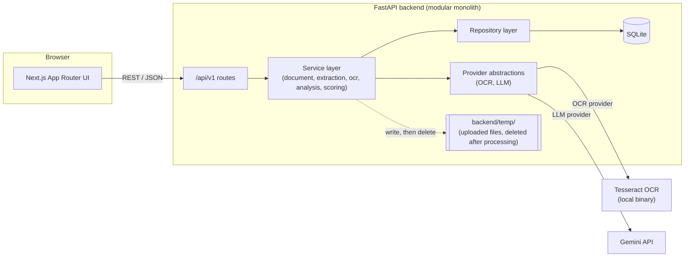
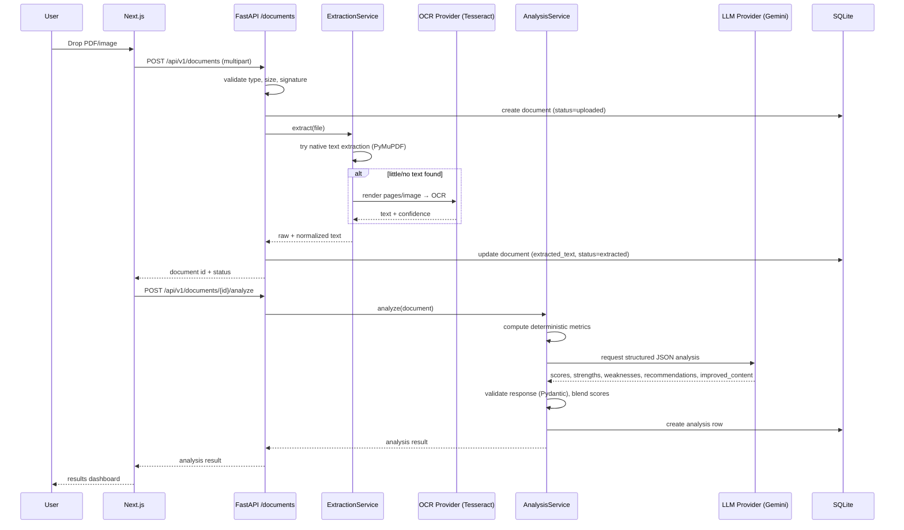

# Architecture

SocialLens is a clean **modular monolith**: one Next.js frontend, one FastAPI
backend, one SQLite database. No microservices, no message queues, no
container orchestration — those would add operational complexity a
single-developer assessment project doesn't need.

## System overview

## Request flow: upload → analysis

## Layering (backend)

- **api/** — FastAPI routers. Thin: parse request, call a service, return a
  schema. No business logic.
- **services/** — business logic (extraction strategy, OCR orchestration,
  scoring, analysis orchestration). This is where the interesting code lives.
- **repositories/** — SQLAlchemy queries, isolated from services so the ORM
  never leaks into business logic or routes.
- **providers/** — swappable integrations behind small interfaces
  (`OCRProvider`, `LLMProvider`). See [decisions.md](decisions.md) for the
  replacement strategy (Tesseract → cloud OCR, Gemini → another LLM).
- **schemas/** — Pydantic request/response models, separate from SQLAlchemy
  models in `models/`.
- **core/** — cross-cutting config, logging, exceptions.

## Why these choices

- **SQLite, not Postgres**: zero setup, file-based, sufficient for an
  assessment's data volume. Models avoid SQLite-only features so a future
  swap to Postgres is a connection-string change (see decisions.md).
- **No task queue**: extraction/OCR/analysis run synchronously inside the
  request. Processing a single document takes seconds, not minutes — a queue
  would add infrastructure without solving a real problem at this scale.
- **Provider abstractions without extra providers**: `OCRProvider` and
  `LLMProvider` are interfaces with exactly one implementation each
  (Tesseract, Gemini). This keeps the seam for future providers without
  building speculative code for providers that don't exist yet.
- **Temp files, not blob storage**: uploads live in `backend/temp/` only
  for the duration of processing, then are deleted. No S3 bucket needed for
  an app that doesn't retain original files.
